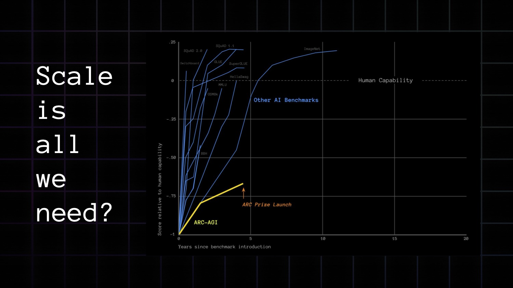
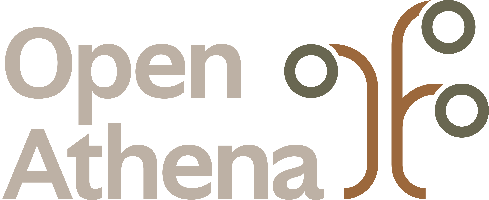
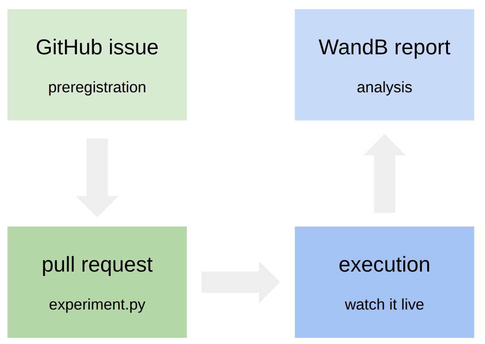
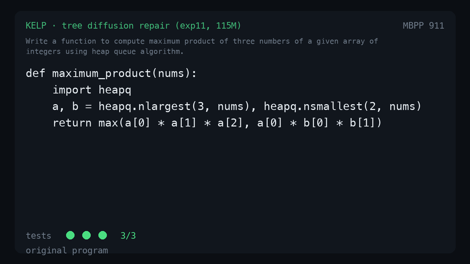
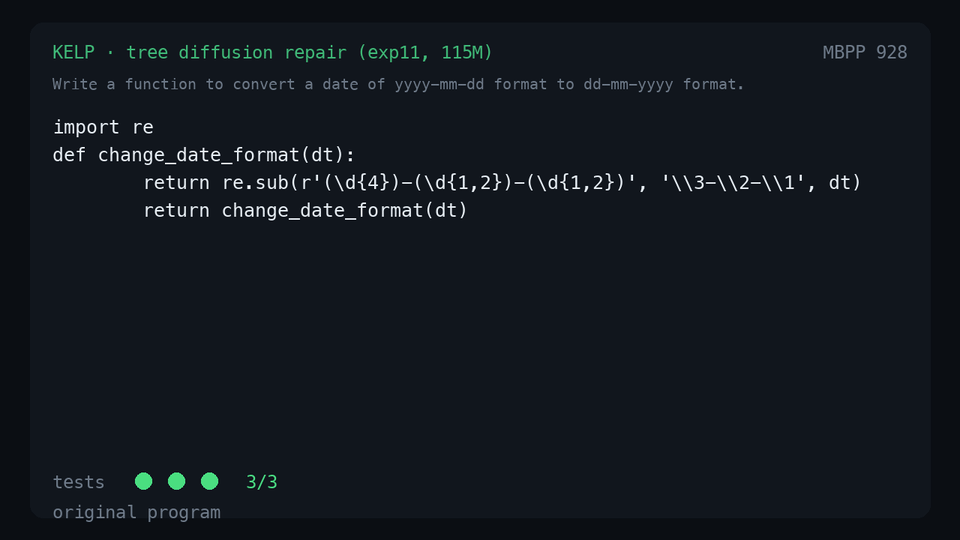

# Thesis
  * I want to collaborate with *you* on my program synthesis experiments. 
  * Let’s build Kelp together!  
  * TL;DR: Kelp is trying to scale up [https://tree-diffusion.github.io/](https://tree-diffusion.github.io/)

# Part I: Motivation {data-background-color="#1F1E1B"}

## Why program synthesis?



::: {.attribution}
arcprize.org — "AGI Tour"
:::

## Why this type of model?

* Why work on ML for program synthesis or neurosymbolic programming?  
* [François Chollet’s 2024 talk](https://arcprize.org/blog/beat-arc-agi-deep-learning-and-program-synthesis): this is a frontier computer science problem _vis a vis_ the ARC-AGI challenge.   
* The _way_ modern LLMs fail on ARC-AGI suggests they act like *skill databases*.   
* TL;DR ARC-AGI: A benchmark designed to _resist memorization_. 
* Since 2020, Chollet has hypothesized that **ML + program synthesis** wins. 
 
## Why is this collaboration a good fit for Open Athena?   

{.logo} 

* OA is a non-profit AI lab that partners with academia to tackle fundamental science challenges using the capabilities at the AI frontier.   

. . .
 
{.logo} 

* A large component of OA is Marin, a community created by Percy Liang at Stanford to create an open development process for making frontier LLMs.

## {.logo} Marin is:   

* An ecosystem for developing transformers and language models  
* An infrastructure for leveraging Google’s TPU Research Cloud effectively  
* A community for frontier LLM research that is open to everyone.   
  * Every success, and more importantly, _failure_, is open to all.  

{.slide-img}


## Marin for Science
* Marin --> “model factory” --> science foundation models
  * MarinMat: [https://tomat.oa.dev/](https://tomat.oa.dev/)   
  * MarinDNA: [https://openathena.ai/marin-dna/](https://openathena.ai/marin-dna/)   
  * MarinFold: [https://github.com/Open-Athena/MarinFold](https://github.com/Open-Athena/MarinFold)   
* Core to all: **token documents** (are these programs?)

. . .

```
[BOS]
[GRID_START]   nx ny nz           [GRID_END]    # parent grid shape
[ATOMS_START]  Z₁ Z₂ … Zₙ         [ATOMS_END]   # atomic numbers
[POS_START]    ⟨x₁ y₁ z₁⟩ …        [POS_END]     # frac coords (3-byte codec)
[SHAPE_START]  P P P                [SHAPE_END]   # patch dims
[OFFSET_START] ix iy iz              [OFFSET_END]  # patch anchor (low corner)
[HI_START]     hx hy hz              [HI_END]      # wrapped high corner
[DENS_START]   d₀ d₁ … d_{P³−1}     [DENS_END]    # density (2-token 9+12 codec)
[EOS]
```

## Why Kelp + CHI-FRO?

* Learning on arbitrary syntax trees fits well with CHI-FRO research interests, like probabilistic programming.  
* As a strategy: it combines rigorous, interpretable logic with modern, (bitter) scaling science.   
* The dream: we create an alternative agentic coding system?

. . .

{.slide-img}

# Part II: A deep dive in Kelp {data-background-color="#1F1E1B"}

```
        ~  ~  ~  ~  ~  ~  ~
       ~  ~  ~  ~  ~  ~  ~  ~
      )  )  )  )  )  )  )  )  )
     (  (  (  (  (  (  (  (  (
      )  )  )  )  )  )  )  )  )
     (  (  (  (  (  (  (  (  (
      )  )  )  )  )  )  )  )  )
     (  (  (  (  (  (  (  (  (
      )  )  )  )  )  )  )  )  )
     (  (  (  (  (  (  (  (  (
      \  |  |  |  |  |  |  |  /
       \ |  |  |  |  |  |  | /
        \|  |  |  |  |  |  |/
         |  |  |  |  |  |  |
         |  |  |  |  |  |  |
    ~~~~~|~~|~~|~~|~~|~~|~~|~~~~~
    -----+--+--+--+--+--+--+-----
         |__|__|__|__|__|__|
              KELP
    Tree Diffusion for Program Repair
```

## Kelp today



## Kelp today — another real repair



## Goals

* Don't *generate* programs token-by-token — **repair** them, edit by edit, on the AST
* Every intermediate state is **valid Python** (the tree-diffusion invariant)
* Hypothesis: constrain the search space to valid AST edits → a *small* model can fix broken programs

. . .

Long-term:

1. **Validate** tree diffusion on real-world Python
2. **Scale** from scratch-trained models to pretrained transfer (Marin 8B)
3. **Measure** scaling laws: corpus × model size × compute


## The Pipeline

```
  Clean Program      Corrupted Program     Edit Sequence         Repaired Program
  ┌────────────┐     ┌────────────┐     ┌───────────────┐     ┌────────────┐
  │ def add(   │     │ def add(   │     │ POS_7         │     │ def add(   │
  │   a, b):   │ ──► │   a, b):   │ ──► │ return a + b  │ ──► │   a, b):   │
  │   return   │     │   return   │     │ EOS           │     │   return   │
  │   a + b    │     │   a - b    │     │               │     │   a + b    │
  └────────────┘     └────────────┘     └───────────────┘     └────────────┘
                     Forward Process     AR Model Predicts     Applied Edit
                     (realistic bug:     (Position + Tokens)
                      operator flip)
```

## Forward Process: plant a *realistic* bug

```
           try first                try next                last resort
  clean ─► near-miss flip ────► in-context swap ────► no realistic bug?
           x > y  →  x < y      right names,               DROP it
           a + b  →  a - b      wrong logic           (never graft alien code)
              │                     │
              ▼                     ▼
           a bug a human writes — still valid Python
```

. . .

* Multiple steps → the "diffusion trajectory"
* Same corruption code in training *and* eval — no train/test mismatch

## SubtreeBank: a palette of real code fragments

```
  BinOp    ──►  [ a + b │ x * scale │ n - 1 │ total / count │ … ]
  Return   ──►  [ return x │ return [] │ return best │ … ]
  If       ──►  [ if x > 0: │ if not seen: │ if len(v) == k: │ … ]
  Call     ──►  [ len(xs) │ max(a, b) │ f(x) │ … ]
                        ▲ indexed from the real training corpus
```

* Augmented 5 ways: original · renamed · perturbed literals · templates · **e-graph rewrites** ([egglog](https://egglog-python.readthedocs.io/): `a + b` ⇄ `b + a`)
* Today: the corruption *fallback* and the generalization eval arm — realistic bugs took over as the default

## Training

```
  ┌── conditioning prefix (optional) ──────────┐┌─ input state ─┐┌──── edit target ────┐
  [PROMPT] docstring [/PROMPT] [SPEC] asserts [/SPEC] program-bytes <SOS> <POS k> repl <EOS>
   ····························· loss masked ····························  ██ supervised ██
```

One training example:

1. **Corrupt** a clean program with 1..S realistic bugs (or 20%: a *random other program* — long-range repair)
2. **TreeDiff** the shortest edit path back to clean
3. **Supervise one step**: random point on that path → predict the *next* edit
4. **Condition** (optional): docstring prompt + executable test asserts, independent dropouts

. . .

* The model itself: a vanilla causal transformer ([Grug](https://github.com/marin-community/marin/tree/main/lib/levanter/src/levanter/grug)/Levanter) on flat tokens
* All the structure lives in the *data*, not the architecture

## Inference: iterative denoising

```
               ┌──────────────── repeat ≤ max_depth ────────────────┐
               │                                                    │
               ▼                                                    │
  corrupted ─► [PROMPT][SPEC] + code ──► model ──► edit ⟨POS k, "…"⟩│
               ▲                                          │         │
               │                                          ▼         │
               └───────────── its own output ◄─────── apply edit ───┘
                                                          │
                                                          ▼
                                                 repaired candidate
```

* One edit per step: *where* (`POS k`) → *what* (replacement bytes)
* The model **denoises its own output** — that's the diffusion

. . .

```
  × N independent rollouts ──► run the tests ──► keep the best   (best-of-N)
  beam of candidates ──► expand, prune by log-prob               (beam search)
```


## Kelp vs the Paper

Kelp scales [Kapur, Jenner & Russell (2024)](https://arxiv.org/abs/2405.20519)
from 8-primitive inverse-graphics DSLs to real Python. 

| Paper | Kelp | Status |
|---|---|---|
| Small subtree mutations, s ~ U[1,5] | Realistic in-context corruption, multi-step | ✅ |
| Reverse-path single-step targets | `tree_diff` path, random-step supervision | ✅ |
| ρ-mixture of random inits (long-range) | `--p-random` random-program pairs | ✅ |
| Goal observation x₀ (target image) | Spec: test asserts + NL intent | 🟡 landed — **testing now (exp12)** |
| Execution feedback x_t (current render) | Run tests per edit; feed back failures | ❌ **the known frontier** |
| Grammar-masked decoding | Byte+position decode, AST position masks | 🟡 validity 100% |
| % solved vs. compute | Tasks fully repaired, CIs, n=500 | 🟡 metric hardening in progress |

## Current results: three hard nulls and an instrument lesson

Eleven experiment cycles, ending with a 12-cell controlled grid (n=500 tasks, bootstrap CIs):

| Lever tested | Result |
|---|---|
| Capacity (115M → 305M) | **flat** — <1pp at every corruption depth |
| Corruption recipe (single- vs multi-step) | **identical** — models solve the *same* tasks (107/109 overlap) |
| Corpus realism (curated library code) | validity 100%, loss saturates (~0.03)… correctness doesn't move |
| The metric itself 🔍 | **96% of "solved" corruptions never broke the tests** — honest repair rate ≈ **2–4%** |

. . .

**The diagnosis writes itself:** the model is not starved of capacity, data, or
training signal — it is starved of **information**. It has never been shown
*what the program should do*.

**Now training (exp12):** condition repair on executable **specs** — test
asserts, sandbox-synthesized for 5.7k functions — the paper's goal observation
x₀, finally ported to Python.

## Open Problems — a.k.a. where *you* come in

1. **Repair is posterior inference**: p(program | spec, execution). Our edit model is a learned *proposal distribution* — and best-of-N is crude importance sampling. Proper **SMC over edit trajectories**, weighted by test outcomes?
2. **What's the right noise model?** Ours is hand-built operator flips — and 96% of our "bugs" never broke a test (the *equivalent-mutant* problem). Wanted: a **probabilistic model of human error**.
3. **Priors over intent**: three asserts radically underdetermine a program. Occam / **language-of-thought priors** over intended semantics?
4. **What should the model observe per step?** Failing asserts? Execution traces? Trace *diffs*? (Our current answer: nothing — that's the wall.)
5. **Beyond Python**: typed generic trees; larger programs; state. Could Kelp repair **probabilistic programs**?

. . .

Every one of these is a runnable experiment away — *let's build Kelp together.* 

# Thanks!  {data-background-color="#1F1E1B"}

- `Repo:` [github.com/OpenAthena/Kelp](https://github.com/Open-Athena/Kelp)
 

- `Email:` [alex@openathena.ai](mailto:alex@openathena.ai)


- `Social:` [bsky.app/al.merose.com](https://bsky.app/profile/al.merose.com)