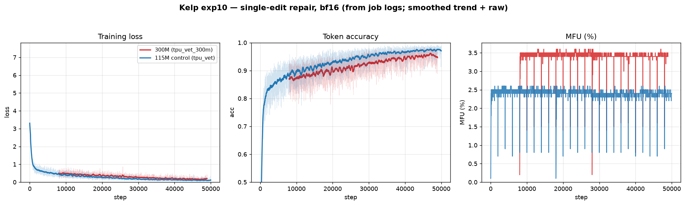

## What is Kelp? {.oa-key}

An **autoregressive edit-prediction model** that repairs programs by *iterative
tree diffusion*: corrupt a program, then learn to denoise it one **syntax-tree
edit** at a time.

- **~115–305M** params, self-supervised on **synthetically-corrupted real Python**
  — no labeled bug/fix pairs.
- Scored on **functional repair** (held-out MBPP, execution-guided), not perplexity.
- Thesis: take the tree-diffusion recipe (Kapur et al., 2024) and **scale it off
  toy DSLs onto real-world code**.

## The problem framing

Program repair as **search over edits** toward a functionally-correct program.

```python
def area(r):
    return 3.14159 * r + r      # target: r * r
```

- The edit space is huge and **mostly harmful**; syntactic validity ≠ functional
  correctness.
- Supervised repair needs **paired bug/fix data** — scarce and distribution-biased.
- Our angle: **self-supervised** synthesis + **tree-structured edits** that are
  syntactically valid *by construction*.

## Tree diffusion

Discrete diffusion over **syntax trees**: a forward *corruption* process and a
learned *denoiser* that edits the tree while preserving the grammar — applied
**iteratively** (edit → execute → re-edit).

- Edits act on the AST, so every intermediate program parses.
- The reverse process pairs naturally with **search** (best-of-N + execution feedback).

<div class="oa-key">
<strong>Kapur, Jenner &amp; Russell (2024)</strong>,
<em><a href="https://tree-diffusion.github.io/">Diffusion on Syntax Trees for Program Synthesis</a></em>,
demonstrated this on small <strong>inverse-graphics DSLs</strong> (2D CSG, SVG-like).
<strong>Kelp scales the recipe to real Python</strong> — larger grammar, longer
programs, docstring conditioning, TPU-scale synthesis.
</div>

## Method: forward process + supervision

<div class="two-col">
<div>

**Corruption (forward)** — a *realistic* cascade, not random grafts:

- operator flips (`==`→`!=`, `+`→`-`)
- variable swaps over in-scope names
- e-graph **near-misses** (semantically-adjacent rewrites)

**Realistic-or-drop**: skip programs with no plausible corruption rather than
inject out-of-distribution edits.

</div>
<div>

**Target (reverse)**

- `TreeDiff` computes a minimal edit path corrupted → clean; sample a step as the
  training target.
- The edit is emitted as **⟨position token, replacement tokens⟩**.
- Causal LM over `[ctx, SOS, POS, repl, EOS]`; cross-entropy on the **edit span
  only**.

</div>
</div>

## Architecture & pipeline

- **Backbone:** causal transformer (Grug blocks — RoPE, SwiGLU, RMSNorm). Byte +
  AST-position tokenizer, **~1.3K vocab** → params dominated by depth, not embeddings.
- **Conditioning:** docstring + signature as a prompt prefix.
- **Data:** streaming synthetic generation (~88 CPU workers) over a curated corpus
  — stdlib, NumPy/SciPy, Flask, JAX, … — on **v6e-4 TPU** via our **Iris** stack.
- **Inference:** best-of-N beam search + **execution-guided reranking**;
  position-constrained decoding to valid AST spans.

# The journey so far {background-color="#1F1E1B" .oa-dark}

## exp9: the *task distribution* was the bottleneck

Earlier runs trained on **alien subtree grafts** + noisy scraped code — low loss
never became functional repair.

Fix: realistic-or-drop corruption + curated corpus (unchanged model).

| MBPP repair (held-out) | before | after |
|---|---|---|
| Best-of-16 functional pass | ~2% | **~15%** |
| Syntactic validity | ~50% | **100%** |

<div class="oa-key">
<strong>matched ≈ unmatched (15.2% vs 14.7%)</strong> — a <em>general</em> repair
skill, not overfit to the training corruption.
</div>

## The wall: valid ≠ correct

Token accuracy saturates (**~92%**) and edits are **100% valid** — yet functional
pass rate sits at **~15%**.

- The model reliably emits *a* valid edit; it's the *right* edit that's hard.
- Bottleneck has moved to **localization + edit correctness** — not validity, not
  data quality.

<div class="oa-box-solid">
This reframes the scaling question: if the wall is localization, does more
<em>capacity</em> even help? exp10 tests exactly that.
</div>

# This week: perf overhaul + a controlled scale test {background-color="#1F1E1B" .oa-dark}

## Training efficiency (landed)

- **Real bf16.** `compute_dtype='bf16'` was a no-op — fp32 master weights forced
  promotion back to fp32 matmuls. Fix: cast matmul *operands* to bf16, keep fp32
  master + fp32 reductions (RMSNorm, logits). Now genuine bf16 `dot_general`.
  <span class="oa-badge copper">~2–4× throughput</span>
- **Fused attention.** A dense `[B,S,S]` mask forced grug onto reference attention
  (materialized O(S²) scores → OOM). Re-expressed as an `AttentionMask` (causal
  flag + segment-id padding) → **TPU splash kernel**, O(S) memory.
- **MFU logging.** `6·N·tokens ⁄ (chips·peak)`, live — the utilization signal W&B
  doesn't capture.

## exp10: two controlled bets

<div class="two-col">
<div>

**Bet 1 — single-edit training**

`max_corruption_steps = 1`. Aligns the training target with the **per-step
iterative inference** (one edit, then re-check) — removes a train/inference mismatch.

</div>
<div>

**Bet 2 — capacity, held cost**

**115M → 305M** at ~equal wall-clock (bf16 + gradient checkpointing), same v6e-4.

*Does capacity move functional repair — or is the bottleneck elsewhere?*

</div>
</div>

<div class="oa-key">
Hold data / batch (64) / LR (3e-4) / steps (50K); vary only <strong>{task, size}</strong>,
plus a <strong>115M single-edit control</strong> → clean attribution.
</div>

## Results so far

Both runs hit 50K overnight — surviving **3 preemptions** via checkpoint-resume.



<div class="oa-muted">
Loss · token-acc · MFU. Confound: at equal steps the 115M shows <em>lower</em> token
loss — expected under-fit of the larger model at fixed budget; token metrics ≠ repair.
Both runs are <strong>data-bound</strong> (MFU 2.5–3.4%), so the 305M is ~free compute-wise.
</div>

## The verdict: capacity didn't move it

Best-of-16 functional repair @ step-48K (100% valid throughout):

| single-edit | matched | unmatched |
|---|---|---|
| 115M control | 17.4% | 18.0% |
| **305M** | **18.8%** | **18.7%** |

- **305M ≈ 115M** (+1.4 / +0.7 pp — within noise): **capacity is not the lever.**
- vs exp9's 115M / 2-step (~15%): **single-edit lifted the floor to ~18%.**
- matched ≈ unmatched again → robust, general repair.

<div class="oa-box-solid">
Confirms exp9: the wall is <strong>localization + the repair loop</strong>, not
parameters. <strong>exp11 attacks decoding/inference</strong> — not scale.
</div>

## Next

- **Validation-during-training** — repair rate vs. step (token loss saturates and
  hides the metric that matters); enables early stopping + live capacity readouts.
- **The repair loop, not the model** — position calibration, execution-guided
  search depth, constrained decoding. That's where 15→18% → *higher* lives.

# Thanks {background-color="#1F1E1B" .oa-dark}

## In one breath

- **Tree-diffusion program repair** (Kapur et al.), scaled to real Python:
  self-supervised synthetic corruption → AR edit prediction → execution-guided search.
- Biggest gains came from the **task distribution**, not scale; the live frontier is
  **valid → correct**.
- Infra this cycle: real bf16, fused attention, MFU logging, preemption-resilient
  training, non-hanging eval.

<div class="oa-muted">
Open Athena · code, experiment logs, and results in the Kelp repo: go.oa.dev/kelp
</div>
